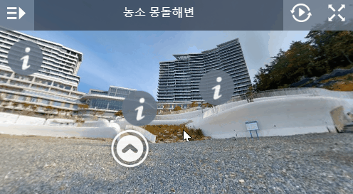

# Marzipano

## About Marzipano
- Marzipano 는 웹기반 파노라마 저작도구입니다.
- Export를 하면 JavaScript 만으로 실행되는 파일들을 얻을 수 있습니다.

## 거제도 벨버디어
거제 벨버디어는 "한화리조트" 중 하나입니다.  
거가대교를 건너 바로 맞이하는 "농소 몽돌해변"을 조망하는 위치입니다.  
101개의 객실을 보유하고 있고, 꽤 비싼 회원권으로 유지되는 시설입니다.  

이 Scene은 [Marzipano 프로그램](https://www.marzipano.net/)을 이용하여 제작되었습니다.  
4개의 파노라마 사진을 이어 하나의 장소를 만들었습니다.

## Projects
- [웹사이트](http://someday.run/mazipano/)
- [GitHub](http://github.com/subokim/mazipano)
- [Demo Site](https://www.marzipano.net/demos.html)

## Features
- SphereGeometry가 아니라 CubeGeometry를 이용해서 구현
- 1장의 큰 사진은 Load 때 여러장의 Cube Tile 로 찢어서 저장
- 이 경우 높은 해상도의 사진을 Display하기 좋음.
- 단, Info 창의 모양 등을 수정하기 힘듬.
- 내부에 3D 모델링된 객체 등을 삽입하기 위해서는 결국 WebGL을 활용해야 함.

## How to start
- JavaScript 로 시작하거나 Node를 이용해서 시작할 수 있습니다.
- [따라하기 문서](https://www.marzipano.net/docs.html)